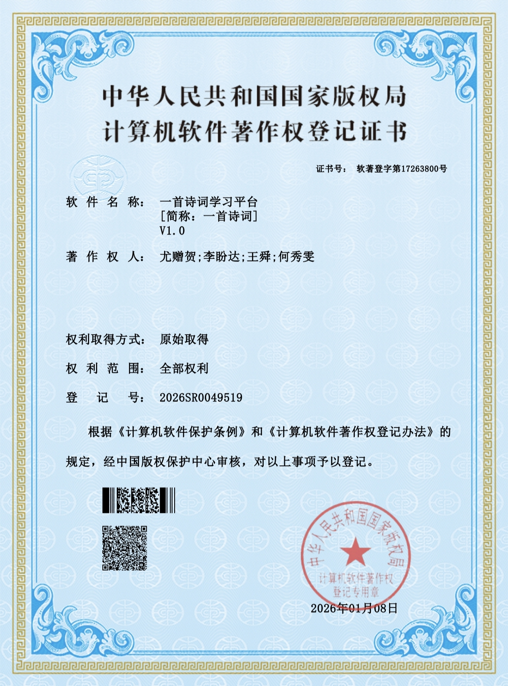

# PoetryNest - 一首诗词学习平台

> 一个基于 Spring Boot 的古诗词学习与社区互动平台，提供诗词浏览、AI 智能对话、选课购买、学习任务管理等功能。

## 软件著作权

本项目已获得国家版权局计算机软件著作权登记（登记号：2026SR0049519）。

<p align="center">
  
</p>

## 项目概述

PoetryNest 是一个面向古诗词爱好者的综合学习平台，采用 **Admin/User 分层架构**，支持角色权限控制。平台集成了 DeepSeek AI 对话、伪微信支付选修购买、学习任务定时提醒等特色功能，致力于提供沉浸式的诗词学习体验。

## 技术栈

| 层次 | 技术 |
|------|------|
| 框架 | Spring Boot 3.2.5 |
| 语言 | Java 17 |
| ORM | MyBatis + PageHelper |
| 数据库 | MySQL 8.x |
| 缓存 | Redis + Spring Cache |
| 认证 | JWT (jjwt 0.12.5) |
| 实时通信 | WebSocket |
| AI 对话 | DeepSeek API |
| 文件存储 | 阿里云 OSS |
| 构建工具 | Maven |

## 项目结构

```
src/main/java/com/poetry/
├── common/          # 公共模块（Result统一响应、ErrorCode错误码、全局异常处理、缓存注解）
├── config/          # 配置类（Redis、CORS、OSS、WebSocket、缓存、AOP切面、DeepSeek）
├── controller/
│   ├── user/        # 用户端接口（11个Controller）
│   └── admin/       # 管理端接口（5个Controller）
├── dto/
│   ├── request/     # 请求DTO
│   └── response/    # 响应VO
├── entity/          # 实体类（12个）
├── mapper/          # MyBatis Mapper接口
├── schedule/        # 定时任务调度
├── security/        # 安全模块（JWT、拦截器、角色校验）
├── service/         # 业务逻辑层（17个Service）
├── util/            # 工具类
└── websocket/       # WebSocket处理器（AI对话、实时通知）
```

## 核心功能

### 用户端 (`/api/user/`)

- **诗词浏览** — 全文搜索、详情查看、随机推荐、导出分享、注解查看
- **社区互动** — 文章发布/评论、点赞/收藏、用户关注、社区主页
- **个人中心** — 资料管理、头像上传、收藏列表
- **诗词答题** — 多类型题目生成与答案校验
- **选课购买** — 伪微信支付，生成订单号即时返回购买成功
- **学习任务** — 创建/开始/完成任务，超时自动取消，到期 WebSocket 提醒
- **AI 对话** — 基于 DeepSeek 的古诗词智能问答（WebSocket 实时推送）

### 管理端 (`/api/admin/`)

- **诗词管理** — 增删改查 + JSON 批量导入
- **注解管理** — 为诗词添加/编辑/删除注解
- **用户管理** — 用户列表、详情查看、角色修改（USER/ADMIN）
- **购买记录** — 查看/创建/取消用户的选修记录
- **任务分配** — 为指定用户分配学习任务

## 安全架构

采用三级拦截器机制：

```
请求 → OptionalAuthInterceptor (order 0) → JwtInterceptor (order 1) → AdminInterceptor (order 2)
              │                                      │                           │
        公开接口可选解析token               /api/** 强制JWT认证            /api/admin/** 校验ADMIN角色
```

- **公开接口**：诗词浏览、答题、文章列表等无需登录
- **认证接口**：收藏、购买、发帖等需要 JWT Token
- **管理接口**：所有 `/api/admin/**` 需要 ADMIN 角色，否则返回 403

## 数据库设计

共 12 张表：

| 表名 | 说明 |
|------|------|
| `user` | 用户表（含 role 字段） |
| `poem` | 诗词表（全文索引） |
| `user_profile` | 用户资料 |
| `favorite_poet` | 喜欢的诗人 |
| `user_favorite` | 诗词收藏 |
| `article` | 社区文章 |
| `comment` | 文章评论（支持嵌套） |
| `article_like` | 文章点赞 |
| `user_follow` | 用户关注 |
| `poem_annotation` | 诗词注解 |
| `user_purchase` | 购买/选修记录 |
| `learning_task` | 学习任务 |

## 快速开始

### 环境要求

- JDK 17+
- MySQL 8.x
- Redis 6.x
- Maven 3.8+

### 配置

1. 创建数据库并执行建表脚本：

```bash
mysql -u root -p < src/main/resources/db/schema.sql
```

2. 修改 `src/main/resources/application-dev.yml` 中的数据库和 Redis 连接信息：

```yaml
spring:
  datasource:
    url: jdbc:mysql://localhost:3306/poetry
    username: root
    password: your_password
  data:
    redis:
      host: localhost
      port: 6379
```

3. （可选）配置 DeepSeek AI 对话，在 `application.yml` 中填入 API Key：

```yaml
deepseek:
  api-key: your_api_key
```

4. （可选）配置阿里云 OSS 用于文件上传。

### 启动

```bash
mvn spring-boot:run
```

服务启动后访问 `http://localhost:8080`。

### WebSocket 端点

| 端点 | 说明 |
|------|------|
| `ws://localhost:8080/ws/ai-chat` | AI 智能对话 |
| `ws://localhost:8080/ws/notification` | 实时通知推送 |

## 特色设计

- **AOP 缓存清除** — 自定义 `@CacheClean` 注解，管理员增删改诗词后自动清除 Redis 缓存
- **伪微信支付** — 模拟微信小程序支付流程，生成唯一订单号，即时返回支付成功
- **定时任务调度** — 每 60 秒扫描超时任务自动取消，每 5 分钟检查即将到期任务并推送 WebSocket 提醒
- **Spring Cache** — 诗词搜索和详情接口缓存 15 分钟，减轻数据库压力

## 许可证

本项目为学习项目，仅供参考学习使用。

软件著作权归 尤赠贺、李盼达、王舜、何秀雯 所有。
